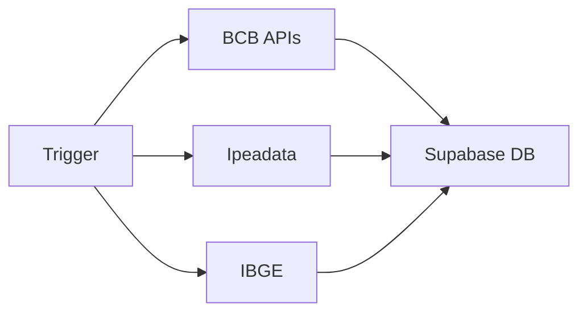

# 📡 APIs Utilizadas no Projeto

## Visão Geral

Este documento descreve todas as APIs externas utilizadas no projeto **Economic Insight**, incluindo endpoints, autenticação, limites e propósitos.

---

## 1. OpenAI API

### 📋 Informações Gerais
- **Provedor:** OpenAI
- **Versão:** v1
- **Base URL:** `https://api.openai.com/v1`
- **Documentação:** https://platform.openai.com/docs/api-reference

### 🔑 Autenticação
```
Authorization: Bearer {OPENAI_API_KEY}
```

### 📍 Endpoints Utilizados

#### `/v1/responses`
**Método:** `POST`

**Função:** Geração de insights automáticos baseados em dados econômicos

**Localização:** `supabase/functions/generate-ai-insights/index.ts`

**Modelo Utilizado:** `gpt-4o-mini`

**Payload:**
```json
{
  "model": "gpt-4o-mini",
  "input": [
    {
      "role": "system",
      "content": "Prompt do sistema..."
    },
    {
      "role": "user",
      "content": "Dados econômicos..."
    }
  ],
  "temperature": 0.7,
  "max_output_tokens": 2048
}
```

**Resposta Esperada:**
```json
{
  "output": [
    {
      "content": [
        {
          "text": "{\"insights\": [...]}"
        }
      ]
    }
  ]
}
```

### ⚠️ Tratamento de Erros
- **Rate Limit (429):** Retry com backoff exponencial (até 5 tentativas)
- **Respeita header:** `Retry-After`
- **Timeout padrão:** Configurável via ambiente

### 💰 Custos
- Modelo `gpt-4o-mini` é otimizado para custo/performance
- Consumo: ~500-1000 tokens por requisição

---

## 2. Banco Central do Brasil (BCB)

### 📋 Informações Gerais
- **Provedor:** Banco Central do Brasil
- **Tipo:** API Pública (sem autenticação)
- **Documentação:** https://dadosabertos.bcb.gov.br/

### 📍 API 2.1: Sistema Gerenciador de Séries Temporais (SGS)

**Base URL:** `https://api.bcb.gov.br/dados/serie/bcdata.sgs.{codigo}/dados`

**Formato:** JSON

**Localização:** `supabase/functions/ingest-economic-data/index.ts`

#### Séries Coletadas

| Indicador | Código | Descrição | Periodicidade |
|-----------|--------|-----------|---------------|
| SELIC | 432 | Taxa Selic Meta (% a.a.) | Irregular |
| PIB | 22109 | Taxa de variação real trimestral | Trimestral |
| Balança Comercial | 22707 | Saldo em US$ milhões | Mensal |

**Exemplo de Request:**
```
GET https://api.bcb.gov.br/dados/serie/bcdata.sgs.432/dados?formato=json&dataInicial=01/01/2024&dataFinal=31/12/2024
```

**Exemplo de Response:**
```json
[
  {
    "data": "02/01/2024",
    "valor": "11.75"
  },
  {
    "data": "01/02/2024",
    "valor": "11.75"
  }
]
```

### 📍 API 2.2: PTAX (Cotação do Dólar)

**Base URL:** `https://olinda.bcb.gov.br/olinda/servico/PTAX/versao/v1/odata`

**Formato:** OData JSON

**Endpoint:**
```
/CotacaoDolarPeriodo(dataInicial=@dataInicial,dataFinalCotacao=@dataFinalCotacao)
```

**Exemplo de Request:**
```
GET https://olinda.bcb.gov.br/olinda/servico/PTAX/versao/v1/odata/CotacaoDolarPeriodo(dataInicial=@dataInicial,dataFinalCotacao=@dataFinalCotacao)?@dataInicial='01-01-2024'&@dataFinalCotacao='12-31-2024'&$format=json&$orderby=dataHoraCotacao%20desc
```

**Formato de Data:** `MM-DD-YYYY`

**Exemplo de Response:**
```json
{
  "value": [
    {
      "dataHoraCotacao": "2024-01-15 13:00:00.000",
      "cotacaoCompra": 4.9123,
      "cotacaoVenda": 4.9129
    }
  ]
}
```

**Dados Coletados:** `cotacaoVenda` (USD/BRL)

### 📊 Limites e Boas Práticas
- ✅ Sem limite de rate
- ✅ Dados atualizados diariamente
- ⚠️ PTAX não possui cotação em finais de semana/feriados
- 📅 Período recomendado: últimos 6 meses para dólar, 2 anos para outros

---

## 3. Ipeadata (IPEA)

### 📋 Informações Gerais
- **Provedor:** Instituto de Pesquisa Econômica Aplicada
- **Tipo:** API Pública OData v4
- **Base URL:** `http://www.ipeadata.gov.br/api/odata4`
- **Documentação:** http://www.ipeadata.gov.br/api/

### 📍 Endpoint

**Resource:** `/ValoresSerie(SERCODIGO='{codigo}')`

**Localização:** `supabase/functions/ingest-economic-data/index.ts`

#### Séries Coletadas

| Indicador | Código | Descrição |
|-----------|--------|-----------|
| IPCA | PRECOS12_IPCAG12 | Inflação IPCA acumulada 12 meses (% a.a.) |
| IGP-M | IGP12_IGPMG12 | IGP-M acumulado 12 meses (% a.a.) |

**Exemplo de Request:**
```
GET http://www.ipeadata.gov.br/api/odata4/ValoresSerie(SERCODIGO='PRECOS12_IPCAG12')
```

**Exemplo de Response:**
```json
{
  "value": [
    {
      "SERCODIGO": "PRECOS12_IPCAG12",
      "VALDATA": "2024-01-01T00:00:00",
      "VALVALOR": 4.62
    },
    {
      "SERCODIGO": "PRECOS12_IPCAG12",
      "VALDATA": "2024-02-01T00:00:00",
      "VALVALOR": 4.51
    }
  ]
}
```

### 📊 Características
- ✅ Sem autenticação requerida
- ✅ Dados históricos extensos (desde 1990s)
- 📅 Atualização mensal
- ⚠️ API retorna TODO o histórico (filtrar últimos 24 meses no código)

---

## 4. IBGE - Serviço de Dados

### 📋 Informações Gerais
- **Provedor:** Instituto Brasileiro de Geografia e Estatística
- **Tipo:** API REST Pública
- **Base URL:** `https://servicodados.ibge.gov.br/api`
- **Documentação:** https://servicodados.ibge.gov.br/api/docs

### 📍 Endpoint

**Resource:** `/v3/agregados/{agregado}/periodos/{periodo}/variaveis/{variavel}`

**Localização:** `supabase/functions/ingest-economic-data/index.ts`

#### Agregado Utilizado

| Agregado | Variável | Descrição | Fonte |
|----------|----------|-----------|-------|
| 6381 | 4099 | Taxa de desocupação (%) | PNAD Contínua |

**Exemplo de Request:**
```
GET https://servicodados.ibge.gov.br/api/v3/agregados/6381/periodos/-24/variaveis/4099?localidades=N1[all]
```

**Parâmetros:**
- `periodos/-24`: Últimos 24 períodos
- `localidades=N1[all]`: Nacional (todo o país)

**Exemplo de Response:**
```json
[
  {
    "id": "4099",
    "variavel": "Taxa de desocupação",
    "unidade": "%",
    "resultados": [
      {
        "classificacoes": [],
        "series": [
          {
            "localidade": {
              "id": "1",
              "nivel": "N1",
              "nome": "Brasil"
            },
            "serie": {
              "202401": "7.8",
              "202402": "7.9",
              "202403": "7.6"
            }
          }
        ]
      }
    ]
  }
]
```

### 📊 Características
- ✅ Sem autenticação
- ✅ Dados trimestrais móveis
- 📅 Formato de período: `YYYYMM` ou `YYYYQQ`
- ⚠️ Valores podem ser "..." (dados não disponíveis)

---

## 🔄 Fluxo de Dados

### Ingestão de Dados (`ingest-economic-data`)



**Frequência:** Agendada via cron job ou manual

**Deduplicação:** Por `user_id + indicator + reference_date`

**Batch Size:** 500 registros por upsert

### Geração de Insights (`generate-ai-insights`)


**Trigger:** Click do usuário no dashboard

**Rate Limiting:** Retry com backoff exponencial

---

## 🔐 Variáveis de Ambiente

### Requeridas

```bash
# Supabase
SUPABASE_URL=https://your-project.supabase.co
SUPABASE_ANON_KEY=eyJhbGc...
SUPABASE_SERVICE_ROLE_KEY=eyJhbGc...

# OpenAI
OPENAI_API_KEY=sk-proj-...
```

### Configuração Local

1. Copie `.env.example` para `.env.local`
2. Preencha as chaves de API
3. Para Supabase Functions: configure via `supabase secrets set`

```bash
supabase secrets set OPENAI_API_KEY=sk-proj-...
```

---

## 📊 Monitoramento e Logs

### Logs das Functions

```bash
# Ver logs em tempo real
supabase functions logs generate-ai-insights --tail

# Ver logs específicos
supabase functions logs ingest-economic-data --limit 100
```

### Métricas Importantes

- **Taxa de sucesso:** % de requests bem-sucedidas
- **Latência:** Tempo médio de resposta
- **Rate limits:** Contagem de 429 errors
- **Erros de parsing:** Falhas ao processar respostas

---

## 🚨 Tratamento de Erros

### Estratégias por API

| API | Erro | Estratégia |
|-----|------|-----------|
| OpenAI | 429 (Rate Limit) | Retry com backoff exponencial (5x) |
| BCB | Timeout | Log e retorna array vazio |
| Ipeadata | Dados inválidos | Filtro de NaN/null |
| IBGE | Formato incorreto | Parsing defensivo |

### Fallbacks

- **Insights:** Retorna array vazio se OpenAI falhar
- **Dados econômicos:** Continua com outros indicadores se um falhar
- **Frontend:** Mostra mensagem amigável ao usuário

---

## 📚 Referências

- [OpenAI API Docs](https://platform.openai.com/docs)
- [BCB API Docs](https://dadosabertos.bcb.gov.br/)
- [Ipeadata API](http://www.ipeadata.gov.br/api/)
- [IBGE Serviços](https://servicodados.ibge.gov.br/api/docs)
- [Supabase Edge Functions](https://supabase.com/docs/guides/functions)

---

## 📝 Changelog

| Data | Versão | Mudanças |
|------|--------|----------|
| 2026-02-11 | 1.0 | Documentação inicial das APIs |

---

## 👥 Contribuindo

Para adicionar novas APIs:

1. Documente o endpoint e autenticação
2. Adicione exemplos de request/response
3. Implemente tratamento de erros
4. Atualize este documento
5. Adicione testes de integração

---

**Última atualização:** 11 de fevereiro de 2026
