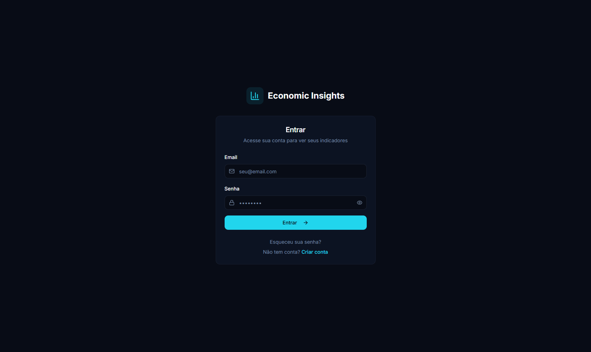
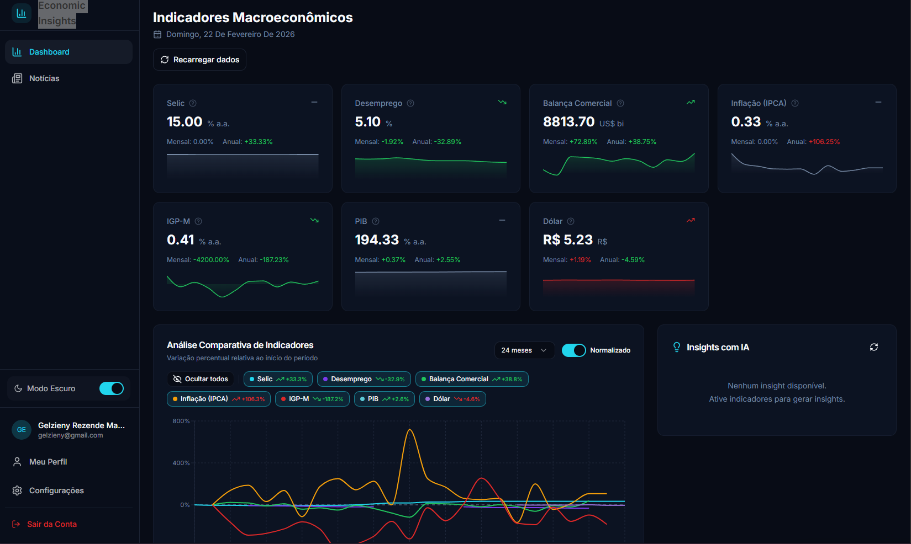
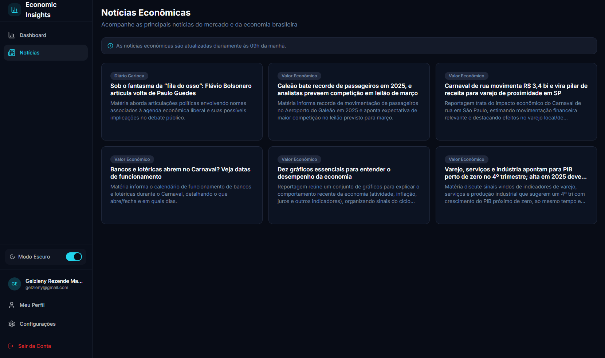
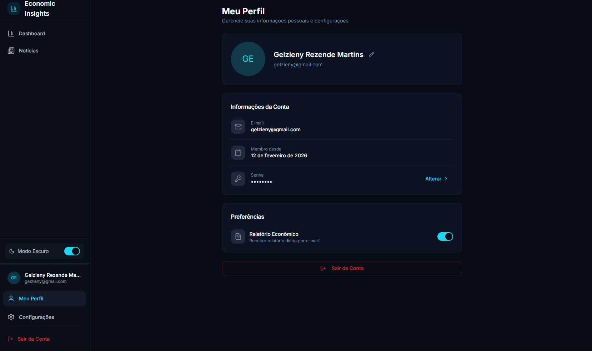

<h1  align="center">
 📊 Economic Insights
</h1>

Plataforma web para visualização de indicadores macroeconômicos brasileiros, análise comparativa, matriz de correlação e acompanhamento de notícias econômicas.

Interface moderna em modo escuro, com dashboards interativos e geração futura de insights com IA.

## 🎓 Sobre o Projeto

Este projeto foi desenvolvido durante o programa DiverseDEV, da Ada, em parceria com o Mercado Eletrônico — uma imersão prática em desenvolvimento, low-code e construção de produto com visão estratégica.

Ao longo do programa, aplicamos conceitos de engenharia de software, análise de dados, automação e desenvolvimento de produto para construir uma solução completa, do frontend às integrações com backend e IA.

## 🌐 Acesso à Aplicação

👉 **Produção:**  
[https://remix-of-economic-insight.vercel.app/](https://remix-of-economic-insight.vercel.app/)

## 📸 Preview do Projeto

  
  
  
  

## 🚀 Funcionalidades

- React 18
- Vite
- TypeScript
- TailwindCSS
- Lovable
- Supabase (autenticação e backend)

### **Crie issues no seu repositório**
   
  - Acesse o repositório no GitHub
  - Crie issues com a label `published`
  - Escreva o conteúdo dos posts em Markdown

## 🤝 Contribuindo

Contribuições são sempre bem-vindas! Sinta-se à vontade para abrir issues ou enviar pull requests.

## 📝 Licença

Este projeto está sob a licença MIT. Veja o arquivo [LICENSE](LICENSE) para mais detalhes.

# 🧑🏻‍💻 Autor

Feito com ❤️ por Gelzieny R. Martins 👋🏽 [Entre em contato!](https://gelzieny-dev.vercel.app/)

---

⭐ Se este projeto foi útil, considere dar uma estrela!

